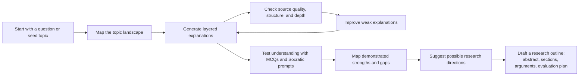
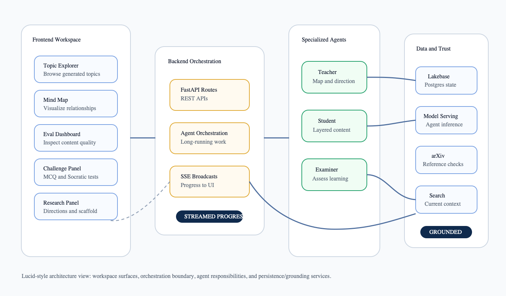
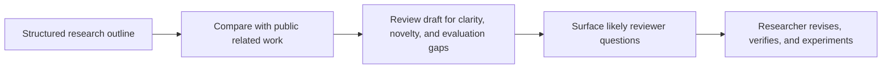

# From Curiosity to AI Research Direction: Building Gurukul

AI research is easier to enter than ever, but still hard to navigate well.

Papers, model families, training recipes, inference techniques, and agent patterns appear faster than most learners can organize them into a durable mental model. Experienced research scientists often have established habits for reading papers, tracking ideas, validating hypotheses, and building research taste. Budding and intermediate AI research explorers are often still building that structure.

Gurukul was built for that second group: people who are curious and technically capable, but need help moving from scattered reading to a clearer research direction. It does not replace traditional research training, and it does not write papers for the user. It makes the path from exploration to contribution more structured, inspectable, and honest about what still requires human judgment.

## Key Highlights

1. Gurukul turns a seed topic into a living knowledge graph, not a static syllabus.
2. Teacher, Student, and Examiner agents split the work of mapping, explaining, and assessing.
3. The app streams progress so long-running agent work is visible to the learner.
4. Generated content goes through grounding, guardrails, and quality evaluation.
5. Research direction discovery depends on demonstrated understanding, not self-rated confidence.
6. The final artifact is a structured research outline, not a finished paper.
7. The intended user is the emerging AI research explorer who needs structure, feedback, and a bridge from learning to original thinking.

## The Problem: Reading Is Not the Same as Research Readiness

Many learners can collect papers, watch lectures, and ask chatbots for summaries. That helps, but it often leaves three questions unanswered:

1. **What should I learn next?**
2. **Do I actually understand the concepts well enough to reason with them?**
3. **How does this learning turn into a research direction?**

Those questions shaped Gurukul more than the choice of any model or framework. The goal was not to build another content generator. The goal was to build a guided research learning loop.

## The Learning Loop



This loop matters because learning should not stop at reading. The learner explores a landscape, studies concepts, improves weak material, demonstrates understanding, and only then moves toward a research artifact.

The final artifact is called a `PaperScaffold` in the code. For a reader, it is better to think of it as a structured research outline: a working title, abstract, paper sections, key arguments, evaluation strategy, and possible venues. It is not a finished paper.

## The Design Principles

Gurukul was built around five principles:

1. **Structure before scale:** a connected map is more useful than a long list of disconnected summaries.
2. **Separation of responsibilities:** mapping a field, explaining a topic, and examining understanding are different jobs.
3. **Visible progress:** long-running agent work should stream back to the user.
4. **Demonstrated understanding:** research readiness should come from assessment, not confidence ratings.
5. **Human ownership:** the system can scaffold direction, but the researcher must verify, experiment, and write.

These principles shaped both the product flow and the architecture.

## How Gurukul Was Built

### 1. Start With a Workspace, Not a Document

The first choice was to build a workspace rather than a linear document generator. A document answers one prompt. A workspace preserves a journey.

Gurukul uses a React and Vite frontend organized around five surfaces:

1. **Topic explorer:** browse the generated concept tree.
2. **Mind map:** visualize how topics connect.
3. **Topic content view:** read layered explanations.
4. **Eval dashboard:** inspect content quality.
5. **Research panel:** connect competence, directions, and research outlines.

The simpler alternative was a single prompt-to-document flow: enter a topic, receive a long explanation, and stop there. That would have been easier to build, but it would lose the learner's journey through concepts, weak areas, assessments, and research ideas.

The workspace approach accepts more UI complexity in exchange for a persistent learning environment.

### 2. Put Long-Running Work Behind Orchestration

Exploration is not a single request-response interaction. Topic mapping, content generation, evaluation, and assessment can take time. If that work happens invisibly, the user is left waiting and guessing.

Gurukul uses a FastAPI backend to coordinate this work and streams progress to the frontend through Server-Sent Events.

A simplified version of the exploration flow looks like this:

```python
# Simplified example
@router.post("/explore")
async def explore(seed: str, parent_id: str | None = None):
    async def run_exploration():
        await do_decompose(seed=seed, parent_id=parent_id)
        await do_generate_all_queued()

    asyncio.create_task(run_exploration())
    return {"ok": True, "seed": seed}
```

This snippet matters because it shows the design boundary: the UI triggers exploration, but the backend owns the long-running agent workflow. The trade-off is more orchestration and state management, but the user gets a responsive interface instead of waiting on a silent request.

### 3. Split the Work Across Teacher, Student, and Examiner

The next decision was to avoid one all-purpose agent. Gurukul uses specialized agents instead:

1. **Teacher agent:** maps a seed topic into a typed knowledge graph and later helps generate research directions.
2. **Student agent:** writes layered topic content with mechanisms, trade-offs, limitations, references, and open problems.
3. **Examiner agent:** creates diagnostic MCQs and runs Socratic assessments to test understanding.

The simpler alternative was one agent that maps, writes, evaluates, and examines. That is attractive at first because it reduces orchestration. But the responsibilities pull in different directions. A good Teacher should be concise and structural. A good Student should explain deeply. A good Examiner should be skeptical and specific.

The Teacher prompt captures this separation clearly:

```text
Your job is NOT just listing subtopics.
You must decompose topics into a KNOWLEDGE GRAPH:
- each topic has a category
- connections are conceptual
- edge rationales must reflect real relationships
- omit uncertain techniques rather than guessing
```

This is not included to expose prompt internals for their own sake. It shows the design intent: the first job is to map the landscape, not to produce another summary.

### 4. Preserve the Learner's Journey Over Time

Research learning is cumulative. A learner's past questions, weak areas, assessed strengths, and research ideas should not disappear after each prompt.

Gurukul persists the learner's graph, content, assessments, misconceptions, evaluations, and research artifacts in Lakebase, a managed Postgres database on Databricks.

The stored state includes:

1. **Topics and graph edges:** the evolving map of the field.
2. **Generated topic payloads:** the layered explanations.
3. **MCQ questions and responses:** diagnostic checks for misconceptions.
4. **Socratic challenge sessions:** open-ended understanding checks.
5. **Evaluations and improvement actions:** quality signals and repair loops.
6. **Misconceptions and competence signals:** evidence of strengths and gaps.
7. **Research directions and outlines:** the bridge toward contribution.

The alternative was a stateless chat-like experience. That would be easier to prototype, but it would lose the signals needed to answer: What has this learner explored? Where are they weak? Which topics are strong enough to support a research direction?

### 5. Use Structured Outputs as the System Contract

Agent outputs are constrained with JSON schemas. This is not just an implementation detail. It is the contract that lets the UI render graphs, quizzes, evaluations, and research outlines reliably.

Free-form Markdown is flexible for reading, but brittle for applications. Gurukul needs structured objects it can store, score, connect, and render.

For example, the research outline shape is intentionally explicit:

```ts
// Simplified shape
interface ResearchOutline {
  title: string;
  abstract: string;
  sections: {
    heading: string;
    purpose: string;
    key_points: string[];
    source_topics: string[];
  }[];
  key_arguments: string[];
  evaluation_strategy: string;
  potential_venues: string[];
}
```

This is where the internal term `PaperScaffold` becomes clearer for readers. It is not a paper generator. It is a structured outline that helps a learner organize a possible contribution.

### 6. Pair Generation With Grounding and Evaluation

Because Gurukul generates research content, it also needs mechanisms for checking quality. Otherwise, the system could make learning feel easier while quietly introducing errors.

The system uses several layers:

1. **arXiv verification:** checks references and recent papers.
2. **Web search:** adds current model details where training-cutoff knowledge may be stale.
3. **Guardrails:** check citation quality, structure, and ungrounded claims.
4. **Eval dashboard:** scores grounding, references, structure, epistemic markers, factual accuracy, comprehensiveness, technical depth, and research readiness.

The goal is not to claim perfect correctness. The goal is to make uncertainty visible so the learner knows what to verify before relying on the material.

This was a deliberate boundary. AI-generated research content can be useful, but it can also create convincing mistakes. Gurukul therefore treats generation and evaluation as paired steps. The trade-off is more model calls and more system complexity, but the result is a learning environment that exposes quality instead of hiding it.

### 7. Test Understanding Instead of Asking for Confidence

Gurukul avoids relying on self-rated confidence. Confidence can be useful, but it is a weak proxy for research readiness. The Examiner agent tests understanding in two ways:

1. **MCQs:** identify specific misconceptions across recall, mechanism, trade-off, and application.
2. **Socratic assessment:** asks the learner to explain, apply, contrast, teach back, or debug a concept.

The backend records answers, computes dimension-level scores, tracks misconceptions, and updates the competence map. This shifts the learning signal from "I read this" to "I can reason with this."

The alternative was a simpler progress model: read/unread states, confidence ratings, or completion percentages. Those are easy to display but weak indicators of research readiness. Gurukul uses assessment because research requires transfer: explaining mechanisms, applying concepts to new situations, and seeing trade-offs.

### 8. Turn Demonstrated Understanding Into a Research Starting Point

The Research Panel uses the competence map to decide when to unlock research direction discovery. It looks at assessed topics, scores, misconceptions, open problems, and graph connections. The point is not to reward activity. It is to identify where the learner has enough demonstrated understanding to begin thinking about contribution.

When the learner is ready, Gurukul can suggest directions and draft a structured research outline with:

1. **Working title:** the research idea in one line.
2. **Abstract:** the initial framing.
3. **Section structure:** how the argument could unfold.
4. **Key arguments:** the claims the researcher must validate.
5. **Evaluation strategy:** how the idea might be tested.
6. **Potential venues:** where the work may fit if executed well.

The alternative was to generate a complete paper draft. Gurukul deliberately avoids that. A finished paper requires verified novelty, experiments, interpretation, and authorship judgment. A structured outline is a better boundary: it helps the researcher organize a direction without pretending the hard research work is complete.

## Architecture at a Glance



This architecture view is intentionally Lucid-style rather than Mermaid-style. The goal is to show ownership boundaries: what belongs in the learner workspace, what the backend orchestrates, what each agent owns, and where state and grounding live.

## What Makes This Useful

Gurukul is useful because the pieces reinforce each other for learners who are still building research fluency:

1. **The graph** gives structure to a fast-moving field.
2. **Layered content** makes topics approachable without flattening the technical depth.
3. **Assessment** exposes gaps that reading alone can hide.
4. **Evaluation** keeps generated material inspectable.
5. **Research outlines** connect learning progress to concrete next steps.

The important point is not that Gurukul uses agents. It is that each agent is placed at a specific point in the learning loop. The Teacher creates structure, the Student fills it with layered content, the Examiner tests understanding, and the Research Panel connects demonstrated competence to possible directions.

## What It Does Not Automate

Gurukul deliberately stops at the research outline. The researcher still needs to verify papers, confirm the gap, design experiments, run them, interpret results, and write the final paper.

That boundary is important. The system can help an emerging researcher find a path, but the research contribution remains the user's work.

## Future Direction: From Learning Support to Draft Review

A natural next step is to make Gurukul more useful after a learner has formed a research idea. Today, the system helps them move from curiosity to a structured outline. In the future, Gurukul could also help them pressure-test that outline against a broader research and review context.

One direction is to index a larger corpus of public research papers, including arXiv papers and related public research documents. That would let Gurukul help learners compare their idea against a wider body of related work, identify missing background, and check whether a proposed contribution is framed clearly enough.

Another direction is to combine paper corpora with public review datasets and review APIs, such as PeerRead, ASAP-Review, and the OpenReview API. The goal would not be to simulate acceptance or replace reviewers. It would be to help emerging researchers understand common review concerns: unclear motivation, weak related work, unsupported novelty claims, missing baselines, vague evaluation plans, or overstated conclusions.

In that version of Gurukul, the flow could extend beyond the current research outline:



This would keep the same human-in-the-loop principle. Gurukul could help a researcher review their work before submission, but the claims, experiments, interpretation, and final authorship would remain with the researcher.

## Closing Thought

AI research education needs more than summaries. It needs systems that help emerging researchers build connected understanding, test that understanding, and turn curiosity into well-grounded research directions.

Gurukul was built with that workflow in mind: explore, learn, evaluate, assess, and scaffold the next step. The longer-term opportunity is to help emerging researchers not only find a direction, but also prepare their work with more clarity, evidence, and awareness of how research is reviewed.

## Sources and Further Reading

- [Gurukul GitHub repository](https://github.com/suneelsunkara-db/gurukul)
